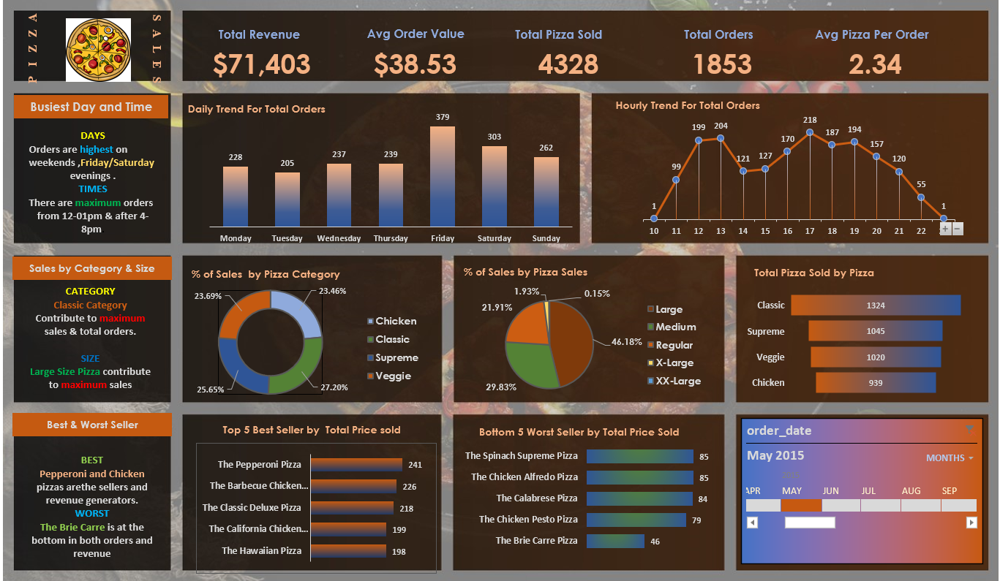

# Pizza_Sales_Analysis

* Conducted Pizza Sales Analysis using Excel and Microsoft SQL Server.
* Executed SQL queries to validate dashboard insights.
* Analyzed key KPIs: Total Revenue, Average Order Value, Total Orders, and Total Pizzas Sold.
* Created visualizations for:
* Daily and hourly sales trends.
* Sales distribution by pizza category and size.
* Top 5 best-selling and bottom 5 worst-selling pizzas.
* Ensured data accuracy and provided actionable business insights.

KEY INSIGHTS :
1. DAYS
* Days in which orders are highest on weekends ,Friday/Saturday evenings 
2. TIMES
* There are maximum orders from 12-01pm & after 4-8pm.
3. CATEGORY
* Classic Category contribute to maximum sales & total orders.
4. SIZE
* Large Size Pizza contribute to maximum sales.
5. BEST
* Pepperoni and Chicken pizzas are the sellers and revenue generators.
6. WORST
* The Brie Carre is at the bottom in both orders and revenue .

